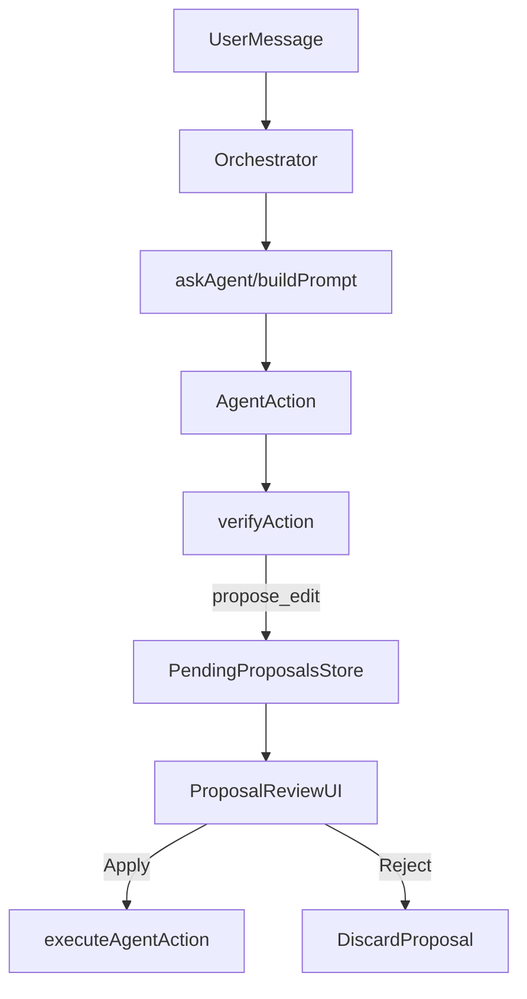

# Next-gen agent workflow: Review-first + grounded edits

## What "next gen" means here

Based on current patterns for AI-in-collab editors and tool-calling safety, the biggest upgrade is shifting from **direct execution** to a **Propose → Verify → Apply** pipeline, plus **grounding** (sources) for any non-trivial factual claims.

- External research trends point toward:
  - **Human-in-the-loop review** for agent edits (preview changes, accept/reject) rather than "agent writes directly."
  - **Typed actions + deterministic verifiers** to reduce flaky tool output and prevent unsafe edits.
  - **Visible agent presence** (caret/cursor) during editing so collaborators understand what is happening.

(Research references used while scoping: Tiptap's AI change/suggestion patterns and "AI caret" UX (`https://www.tiptap.dev/docs/content-ai/...`), and 2026 writeups advocating typed action verifiers (`https://dev.to/...typed-actions-verifiers...`).)

## Fit to this repo's architecture

You already have strong building blocks:

- `src/orchestrator.ts`: turn-based queue + heartbeat + phase gating.
- `src/agent.ts`: typed `AgentAction` + basic `validateAction()`.
- `src/agent-actions.ts`: executes actions with editor locking, cursor visualization, and a built-in web search call path (`/api/tavily/search`).

So the upgrade is mostly **augmenting the action types** and **routing doc edits through a review queue**.

## Proposed feature set

### 1) "Agent Change Review" mode (default on)

Agents no longer apply `insert`/`replace` directly to the doc. Instead they emit a **proposed change** object that the UI renders as a preview, and the user can accept/reject.

- New action type: `propose_edit`
  - Fields: `target` (heading/anchor), `kind` (insert|replace|delete), `beforeText` (optional), `afterText`, `rationale`, `sources`.
- UI panel shows a list of pending proposals (per agent), with:
  - **diff preview** (before/after)
  - **Apply** / **Reject** / **Ask agent to revise**

When the user clicks Apply, the app converts the proposal into the existing executable actions (`insert`/`replace`/`delete`) and runs them through `executeAgentAction()`.

Why this is "next gen":

- It keeps collaboration trust high.
- It prevents "oops I overwrote text" moments.
- It is consistent with modern agent safety patterns.

### 2) Deterministic verifier/gate for all agent actions

Add a verifier layer that checks:

- **Schema correctness** (required fields, non-empty strings) — you already do some of this in `validateAction()`.
- **Semantic safety** (no duplicate headings, replace targets exist, delete length caps, max insertion size).
- **Phase rules** (already handled in `orchestrator.ts` via `isActionAllowed()`, but we can centralize policy output for better telemetry).

The verifier returns:

- ACCEPT (ready)
- REWRITE (normalize fields, e.g. trim, clamp sizes)
- DOWNGRADE (convert to `chat` with explanation)

This aligns with the "schema gate pattern" from 2026 tool-calling safety guidance.

### 3) Grounded edits: sources attached to factual claims

Make "research" a first-class path:

- Add a lightweight "source pack" format to `AgentAction` proposals:
  - `sources: Array<{ url: string, title?: string, quote?: string }>`
- Update prompting rules in `buildPrompt()` so that:
  - If the agent introduces numbers, benchmarks, legal claims, or "current state of X," it must either:
    - cite a source via `sources`, or
    - phrase as a hypothesis/estimate.

Implementation-wise, this reuses the existing `search` action path in `agent-actions.ts` (currently calling `/api/tavily/search`).

### 4) Optional: "AI caret" style presence while previewing/applying

You already render an agent cursor and thought bubble. We can refine it to:

- Show a distinct "proposal" cursor state for preview (no mutation).
- Show "applying changes" caret only during user-approved apply.

## Data flow (new)

## Key files to change/add

- Update `src/agent.ts`
  - Extend `AgentActionType` with `propose_edit`
  - Extend `validateAction()` for proposal shape
  - Update `buildPrompt()` to request proposals + citations instead of direct doc edits (except when explicitly allowed)

- Update `src/orchestrator.ts`
  - Add routing: when action is `propose_edit`, emit via a new callback (`onProposedEdit`) instead of calling `executeAgentAction()`.

- Update UI (likely `src/App.tsx` + a new component)
  - Add `PendingProposalsPanel.tsx` with diff preview + apply/reject

- Add `src/agent-verifier.ts`
  - Deterministic verification + downgrade/rewrite helpers

## Risks / constraints

- **Prompt compliance**: even with strong prompts, some models still output executable edits. The verifier + downgrade path prevents surprises.
- **Diff quality**: for `replace`, exact matching is brittle; proposal previews should show "best-effort target" and require explicit apply.
- **Search availability**: `/api/tavily/search` must exist/configured in deployment; if not, sources can be optional and the UI shows "unverified."

## Acceptance criteria

- Agents default to emitting `propose_edit` with rationale.
- Users can review, apply, and reject proposals.
- No agent can mutate the doc without either:
  - explicit user instruction, or
  - user clicking Apply.
- Proposed edits can include sources, and the UI displays them.
